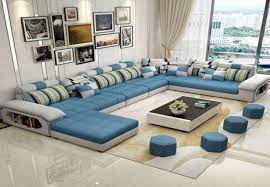
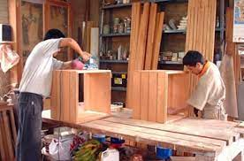

# **MATERIALES MAS USADOS** 
### **ALMACÈN "EL MUEBLE"** 
###### **ELEGANCIA,DISEÑO Y CALIDAD** 

- [PÀGINA PRINCIPAL ](intro.md)
- [MUEBLES EN PROMOCIÒN ](promocion.md)
- [NUESTROS PRODUCTOS ](productos.md)

## **MATERIALES MAS USADOS** 

## **MUEBLES**

A la hora de elegir un mueble para el hogar es importante conocer bien los materiales de muebles a medida que se utilizan en su fabricación, ya que son muy variables dependiendo del mueble y la materia prima utilizada. Por eso es importante estar bien informado para tomar la decisión correcta si queremos un mueble que dure muchos años y se conserve como el primer día. 

### **Aglomerados**

Tiene una densidad baja de madera y está considerado de poca calidad, aunque dentro de los aglomerados también los hay de distintas calidades, dependiendo de su composición y densidad. Está compuesto de viruta de madera, elementos químicos y compactado y debe tener un mínimo de calidad para que los herrajes queden perfectamente y los tornillos puedan unir bien los distintos tableros. Los muebles construidos a base de conglomerado no son recomendables por su baja calidad, tan solo pueden ser una buena opción para el interior de vestidores y armarios siempre que tengan una densidad alta. También se pueden utilizar en muebles de cocina y baño pero siempre que tengan un tratamiento especial hidrófugo. 

#### **Tableros MDF**

Este material está compuesto de fibra de celulosa compactada con unas resinas especiales. Tiene mayor calidad que el conglomerado debido a su densidad y a la utilización de maderas macizas, por eso su precio es superior. Entre los materiales de fabricación en los muebles a medida se considera al MDF como un material premium, con acabados en mate, brillo o laca. 
